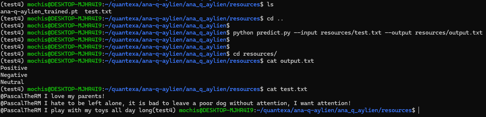

# ana-q-aylien

#### New environment

Run `conda create -n <env-name> python=3.9` if you're using Anaconda or miniconda, alternatively `python3.9 -m venv <env-path>`

Activate:  
Run `conda activate <env-name>` or `source <env-path>/bin/activate`

#### Install PyTorch

The project is developed only to use PyTorch and Numpy, both are bundled together in the PyTorch installation.
This installation is not included as it is specific to each environment and machine:
https://pytorch.org/

#### Install library
Run `make dev`

#### Execute the task
`cd ana_q_aylien`
`python predict.py --input input.txt --output output.txt`

#### Example Execution
`make run`

Then in another console:
`make example-request-predict`

#### Run DEMO
`cd demos/ana-q-aylien`

`make run`
And then copy the URL into your browser to test the amazing demo

#### Testing

`make test`

